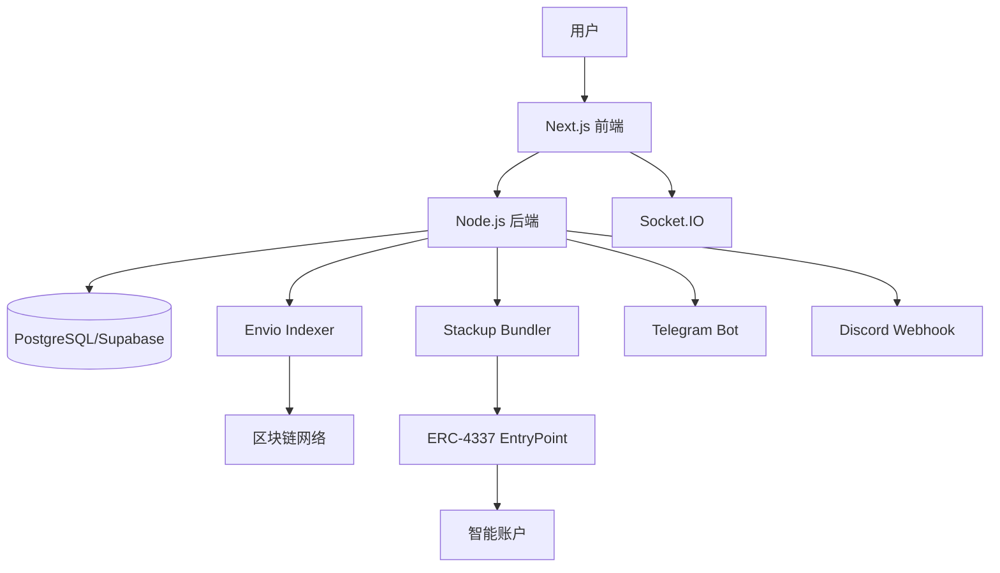

# ChainPulse

> 实时链上事件通知与可视化系统

<div align="center">


[](LICENSE)
[](https://nodejs.org/)
[](https://www.typescriptlang.org/)
[](https://nextjs.org/)
[](https://soliditylang.org/)

[快速开始](#-快速开始) •
[文档](#-文档) •
[特性](#-核心特性) •
[架构](#-技术架构) •
[贡献](#-贡献)

</div>

---

## 📖 项目简介

ChainPulse 是一个实时区块链事件通知和可视化系统，它结合了智能账户集成 (ERC-4337)、事件索引 (Envio)、实时通知 (WebSocket) 和数据可视化，为用户提供即时的区块链事件提醒和自动化交易执行。

### 🎯 核心特性

<table>
<tr>
<td width="50%">

#### 🔐 钱包与智能账户
- 多钱包支持 (MetaMask, WalletConnect 等)
- ERC-4337 智能账户集成
- Gas 费赞助
- 批量操作支持

</td>
<td width="50%">

#### 🔔 实时通知系统
- WebSocket 实时推送
- 多渠道通知 (Web, Telegram, Discord)
- 自定义通知规则
- 优先级管理

</td>
</tr>
<tr>
<td>

#### 📊 数据可视化
- 实时事件时间轴
- 交易活跃度图表
- 网络活动监控
- 钱包活跃趋势

</td>
<td>

#### 🤖 自动化规则
- 条件触发器
- 自动交易执行
- 批量操作自动化
- 规则管理面板

</td>
</tr>
<tr>
<td>

#### 🔍 事件监听
- Envio 实时索引
- 自定义合约监听
- 事件过滤和搜索
- 历史事件查询

</td>
<td>

#### 🌍 用户体验
- 国际化 (中英文)
- 主题切换 (明暗模式)
- 响应式设计
- 玻璃态 UI 设计

</td>
</tr>
</table>

---

## 🚀 快速开始

### 前置要求

- Node.js >= 20.0.0
- pnpm >= 8.0.0 (推荐) 或 npm
- PostgreSQL 或 Supabase 账号

### 安装

```bash
# 克隆项目
git clone <your-repo-url>
cd ChainPulse

# 安装前端依赖
cd frontend
pnpm install

# 安装后端依赖
cd ../backend
npm install

# 安装智能合约依赖
cd ../contracts
npm install
```

### 配置

1. 创建环境变量文件（参考 `.env.example`）
2. 配置 Supabase 数据库
3. 获取必要的 API Keys (Alchemy, Stackup, WalletConnect等)

详细配置指南: [GETTING_STARTED.md](GETTING_STARTED.md)

### 运行

```bash
# 前端 (http://localhost:3000)
cd frontend && pnpm dev

# 后端 (http://localhost:4000)
cd backend && npm run dev

# 智能合约本地节点 (http://localhost:8545)
cd contracts && npx hardhat node
```

---

## 🏗 技术架构

<div align="center">



</div>

### 技术栈

| 层级 | 技术 | 说明 |
|------|------|------|
| **前端** | Next.js 15, React 19, TypeScript | App Router, Server Components |
| **UI** | Tailwind CSS, Shadcn/UI, Recharts | 50+ 组件，玻璃态设计 |
| **后端** | Node.js 20, Express 4, Socket.IO | RESTful + GraphQL + WebSocket |
| **数据库** | PostgreSQL (Supabase), Prisma | ORM, 分区表, RLS |
| **智能合约** | Solidity 0.8.24, Hardhat | ERC-4337, OpenZeppelin |
| **索引器** | Envio | 实时事件索引 |
| **认证** | JWT, Wallet Signature | SIWE (Sign-In with Ethereum) |

---

## 📊 项目进度

**当前版本**: v1.0 (90% 完成)

| 模块 | 进度 | 状态 |
|------|------|------|
| 前端开发 | 100% | ✅ 已完成 |
| 后端开发 | 95% | ✅ 已完成 |
| 智能合约 | 90% | ✅ 已完成 |
| Envio 索引器 | 90% | ✅ 已完成 |
| 数据库设计 | 100% | ✅ 已完成 |
| 前后端集成 | 90% | ✅ 已完成 |
| 文档 | 100% | ✅ 已完成 |

### 已完成功能
- ✅ 钱包连接与认证 (RainbowKit + JWT)
- ✅ 智能账户管理 (ERC-4337)
- ✅ 实时通知系统 (WebSocket + Socket.IO)
- ✅ 事件订阅管理
- ✅ 自动化规则引擎
- ✅ 数据统计与可视化
- ✅ 国际化 (中英文)
- ✅ 主题切换 (明暗模式)
- ✅ GraphQL 客户端集成 (Apollo Client)

### 待完成任务
- ⬜ 智能合约部署到测试网
- ⬜ Envio 索引器部署到 Envio Cloud
- ⬜ 图表可视化实现 (Recharts)
- ⬜ 第三方集成 (Telegram Bot, Discord Webhook)
- ⬜ 前后端集成测试

---

## 📁 项目结构

```
ChainPulse/
├── frontend/          # Next.js 前端应用 ✅ 已完成 (UI + 功能集成)
├── backend/           # Node.js 后端服务 ✅ 已完成 (52个API端点)
├── contracts/         # 智能合约 ✅ 已完成 (ERC-4337 + 测试)
├── indexer/          # Envio 索引器配置 ✅ 已完成 (Schema + Handlers)
├── database/         # 数据库脚本 ✅ 已完成 (10个表 + 索引)
├── docs/             # 技术文档 ✅ 已完成 (6个核心文档)
└── .cursor/          # Cursor AI 配置 ✅ 已完成
```

详细结构: [PROJECT_STRUCTURE.md](PROJECT_STRUCTURE.md)

---

## 📚 文档

### 核心文档

- **[快速开始指南](GETTING_STARTED.md)** - 从零开始运行项目
- **[项目结构说明](PROJECT_STRUCTURE.md)** - 完整项目结构
- **[任务完成报告](TASK_COMPLETION_REPORT.md)** - 开发进度追踪

### 技术文档

- **[产品需求文档](docs/产品需求文档.md)** - PRD
- **[系统技术架构](docs/系统技术架构.md)** - 系统设计
- **[功能交互](docs/功能交互.md)** - 用户流程
- **[数据库设计](docs/数据库设计.md)** - 数据模型
- **[API设计](docs/API设计.md)** - API 规范
- **[开发任务清单](docs/开发任务清单.md)** - 43+ 任务

### 模块文档

- **Frontend**: [README](frontend/README.md) | [开发指南](frontend/DEVELOPMENT_GUIDE.md)
- **Backend**: [README](backend/README.md) | [各子模块文档](backend/src/)
- **Contracts**: [README](contracts/README.md) | [各子模块文档](contracts/)
- **Database**: [README](database/README.md)

---

## 🎨 UI 预览

### Dashboard 仪表板
- 实时统计卡片 (活跃钱包、交易总数、智能账户执行、Gas 费节省)
- 事件时间轴图表
- 事件类型分布图
- 网络活动图表
- 活跃钱包趋势图

### 事件监控
- 事件列表展示
- 实时事件推送
- 事件过滤和搜索
- 事件详情查看

### 智能账户
- 账户卡片展示
- 账户信息查看
- 部署状态跟踪
- 交易历史

### 通知中心
- 通知列表
- 通知设置
- 优先级标记
- 已读/未读管理

---

## 🔄 开发进度

| Phase | 任务数 | 已完成 | 进行中 | 未开始 | 完成率 |
|-------|--------|--------|--------|--------|--------|
| **Phase 1: 基础设施** | 5 | 4 | 1 | 0 | 80% |
| **Phase 2: 用户认证** | 4 | 0 | 0 | 4 | 0% |
| **Phase 3: 智能账户** | 4 | 0 | 0 | 4 | 0% |
| **Phase 4: 事件监听** | 5 | 0 | 0 | 5 | 0% |
| **Phase 5: 实时通知** | 5 | 0 | 0 | 5 | 0% |
| **Phase 6: 数据可视化** | 4 | 2 | 0 | 2 | 50% |
| **Phase 7: 自动化规则** | 3 | 0 | 0 | 3 | 0% |
| **Phase 8: 第三方集成** | 4 | 0 | 0 | 4 | 0% |
| **Phase 9: 优化和测试** | 5 | 0 | 0 | 5 | 0% |
| **Phase 10: 部署** | 4 | 0 | 0 | 4 | 0% |

**总进度**: 6 / 43 任务已完成 (14%)

查看详情: [TASK_COMPLETION_REPORT.md](TASK_COMPLETION_REPORT.md)

---

## 🤝 贡献

我们欢迎所有形式的贡献！

### 开发流程

1. Fork 本仓库
2. 创建特性分支 (`git checkout -b feature/AmazingFeature`)
3. 提交更改 (`git commit -m 'Add some AmazingFeature'`)
4. 推送到分支 (`git push origin feature/AmazingFeature`)
5. 开启 Pull Request

### 代码规范

- 遵循 ESLint 和 Prettier 配置
- 编写清晰的提交信息
- 添加必要的注释和文档
- 确保所有测试通过

### 任务选择

查看 [开发任务清单](docs/开发任务清单.md) 选择任务：

```bash
# 查看未完成任务
grep "⬜ 未开始" docs/开发任务清单.md
```

---

## 📄 许可证

本项目采用 MIT 许可证 - 查看 [LICENSE](LICENSE) 文件了解详情

---

## 👥 团队

- **项目负责人**: _待分配_
- **前端负责人**: _待分配_
- **后端负责人**: _待分配_
- **智能合约负责人**: _待分配_

---

## 🔗 相关链接

- [Envio Documentation](https://docs.envio.dev)
- [ERC-4337 Standard](https://eips.ethereum.org/EIPS/eip-4337)
- [Stackup](https://www.stackup.sh/)
- [Next.js](https://nextjs.org/)
- [Hardhat](https://hardhat.org/)
- [Prisma](https://www.prisma.io/)

---

## ⭐ Star History

如果这个项目对你有帮助，请给我们一个 ⭐！

---

<div align="center">

**Made with ❤️ by ChainPulse Team**

[报告 Bug](https://github.com/your-repo/issues) •
[请求功能](https://github.com/your-repo/issues) •
[加入讨论](https://github.com/your-repo/discussions)

</div>
