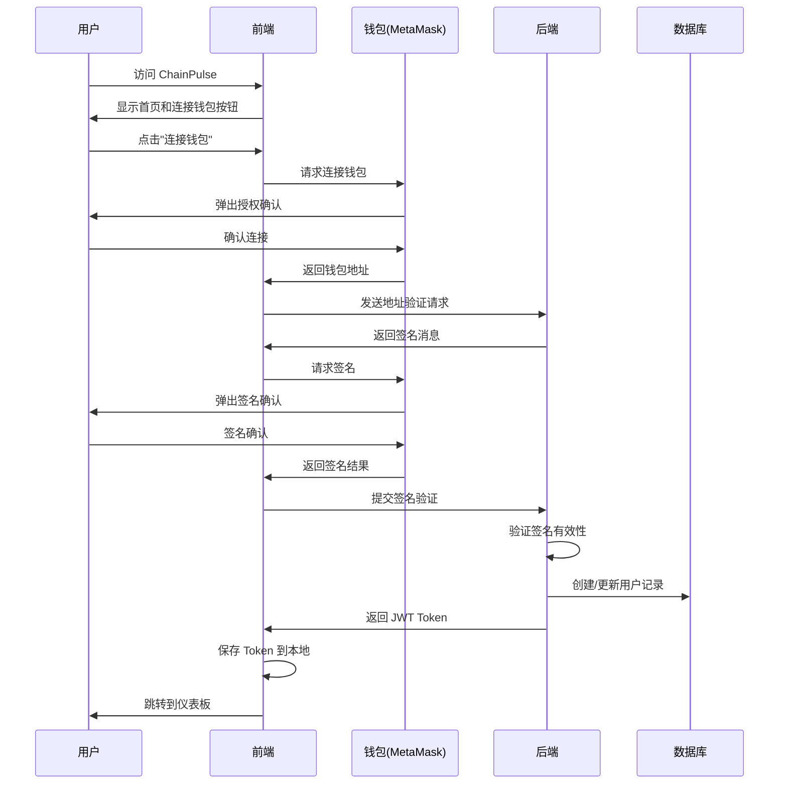
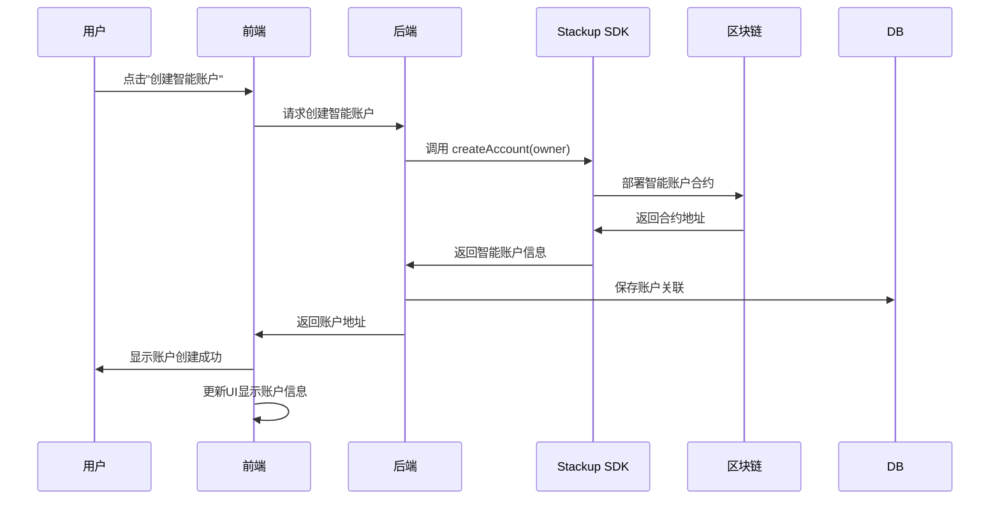
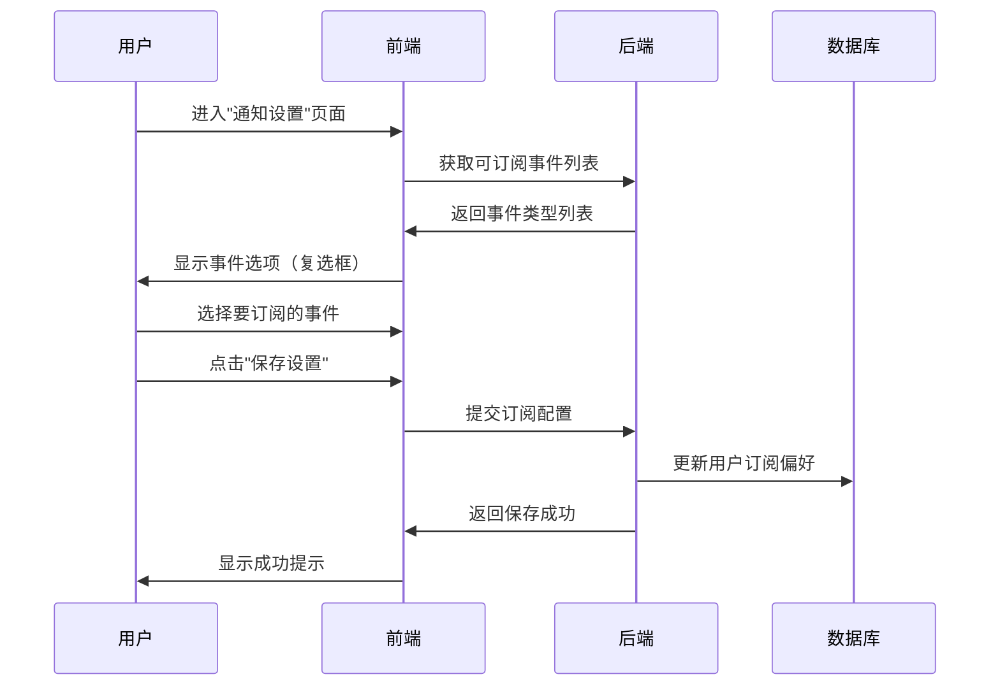
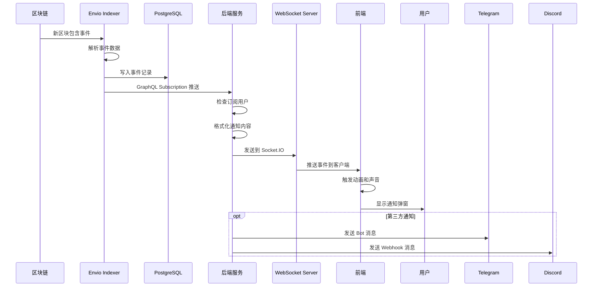
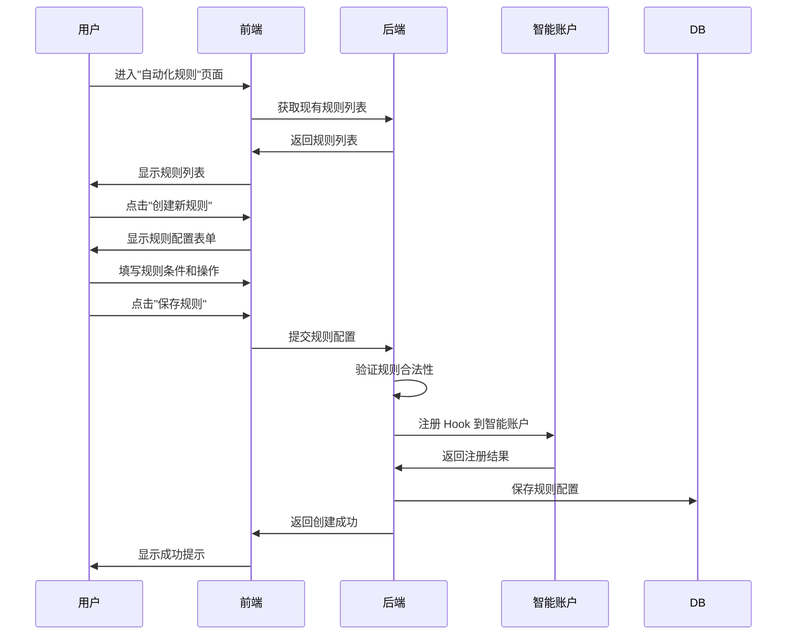
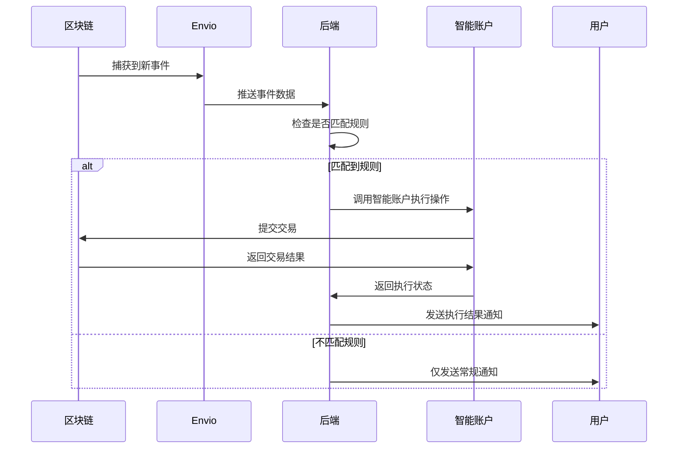
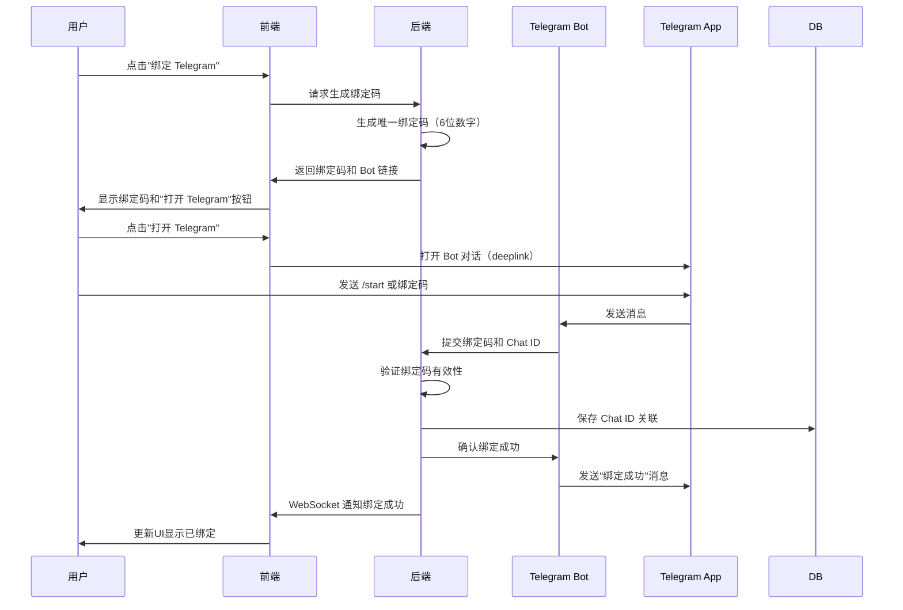
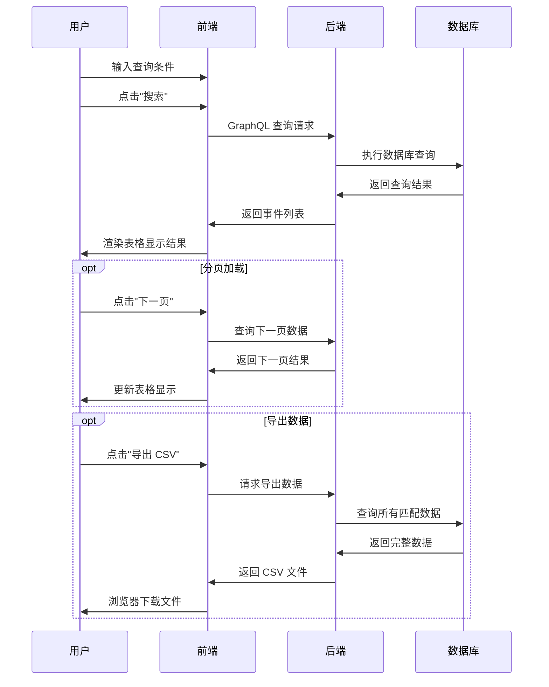
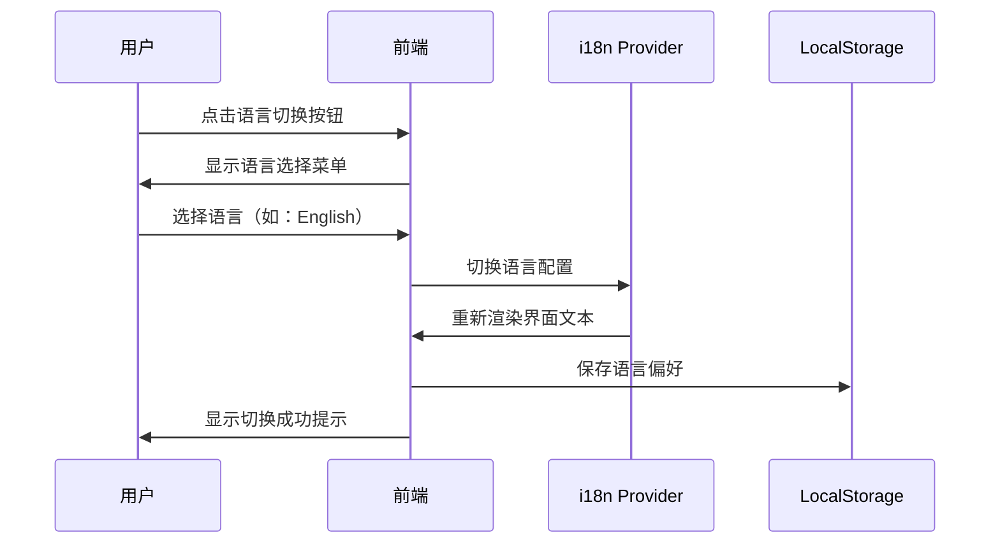
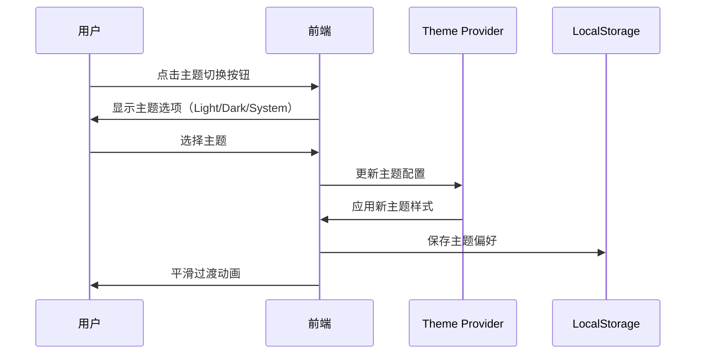

# 功能交互文档

## 项目名称：ChainPulse - 实时链上事件通知与可视化系统

---

## 1. 系统交互流程总览

### 1.1 核心交互链路

```
用户操作 → 钱包交互 → 区块链交易 → 事件触发 → 
Envio捕获 → 后端处理 → 实时推送 → 前端展示 → 
用户感知 → (可选)自动响应
```

---

## 2. 用户注册与钱包连接流程

### 2.1 首次访问流程



### 2.2 用户交互步骤

| 步骤 | 用户操作 | 系统响应 | 预期结果 |
|------|---------|---------|---------|
| 1 | 访问首页 | 显示产品介绍和"连接钱包"按钮 | 用户看到引导界面 |
| 2 | 点击连接钱包 | 弹出钱包选择器（RainbowKit） | 显示 MetaMask、WalletConnect 等选项 |
| 3 | 选择钱包并授权 | 钱包插件弹出连接确认 | 用户确认连接 |
| 4 | 签名验证消息 | 钱包弹出签名请求 | 用户签名以证明身份 |
| 5 | 完成认证 | 后端生成 JWT，前端跳转 | 进入仪表板页面 |

### 2.3 关键技术点

- **钱包连接**：使用 RainbowKit 提供统一的钱包连接界面
- **身份验证**：通过签名验证防止钱包地址伪造
- **会话管理**：JWT Token 存储在 localStorage，有效期 7 天

---

## 3. 智能账户创建与绑定流程

### 3.1 创建智能账户



### 3.2 交互步骤详解

| 步骤 | 操作 | 说明 |
|------|------|------|
| 1 | 用户在仪表板点击"创建智能账户" | 触发智能账户创建流程 |
| 2 | 前端调用后端 API | `POST /api/smart-account/create` |
| 3 | 后端使用 Stackup SDK 创建账户 | 基于 ERC-4337 标准 |
| 4 | 账户合约部署到链上 | 用户的 EOA 作为 Owner |
| 5 | 绑定关系写入数据库 | 关联 EOA 和智能账户地址 |
| 6 | 返回智能账户地址 | 前端展示并允许用户配置 |

### 3.3 智能账户功能配置

用户创建智能账户后，可配置以下功能：

- **自动响应规则**：当特定事件触发时执行预设操作
- **Gas 赞助设置**：配置 Paymaster 支付 Gas
- **批量交易**：一次性执行多笔交易

---

## 4. 事件订阅与通知设置流程

### 4.1 订阅事件类型



### 4.2 可订阅的事件类型

| 事件类别 | 事件名称 | 触发条件 | 默认状态 |
|---------|---------|---------|---------|
| 账户事件 | AccountCreated | 智能账户创建成功 | 开启 |
| 账户事件 | OwnershipTransferred | 账户所有权转移 | 开启 |
| 交易事件 | TransactionExecuted | 智能账户执行交易 | 开启 |
| 交易事件 | TransactionFailed | 交易执行失败 | 开启 |
| 资产事件 | TokenReceived | 收到代币 | 开启 |
| 资产事件 | TokenSent | 发送代币 | 关闭 |
| NFT事件 | NFTReceived | 收到 NFT | 开启 |
| NFT事件 | NFTSent | 发送 NFT | 关闭 |
| DeFi事件 | StakeDeposited | 质押成功 | 开启 |
| DeFi事件 | StakeWithdrawn | 取出质押 | 开启 |

### 4.3 通知渠道配置

用户可选择接收通知的渠道：

1. **浏览器内通知**（默认开启）
   - 实时弹窗提醒
   - 声音提示
   - 动画效果

2. **Telegram 通知**（需绑定）
   - 用户点击"绑定 Telegram"
   - 跳转到 Bot 并发送验证码
   - 后端验证并保存 Chat ID

3. **Discord 通知**（需配置）
   - 用户输入 Discord Webhook URL
   - 系统发送测试消息验证
   - 保存配置

---

## 5. 实时事件监听与推送流程

### 5.1 事件监听完整流程



### 5.2 WebSocket 连接建立

**前端连接代码逻辑**：
```typescript
// 1. 用户登录后建立 WebSocket 连接
socket.connect()

// 2. 发送认证信息
socket.emit('authenticate', { token: jwtToken })

// 3. 订阅特定地址的事件
socket.emit('subscribe', { address: userAddress })

// 4. 监听事件推送
socket.on('event:new', (event) => {
  showNotification(event)
  updateDashboard(event)
})
```

### 5.3 通知展示逻辑

| 步骤 | 操作 | 技术实现 |
|------|------|---------|
| 1 | 接收事件数据 | Socket.IO `event:new` 监听器 |
| 2 | 判断是否在通知中心页面 | React Router 路由状态 |
| 3 | 显示通知弹窗 | Radix UI Toast 组件 + Framer Motion |
| 4 | 播放提示音 | HTML5 Audio API |
| 5 | 更新通知中心列表 | React State 更新 |
| 6 | 更新未读数量徽章 | 全局状态管理（Zustand） |

---

## 6. 数据可视化仪表板交互

### 6.1 仪表板页面布局

```
┌─────────────────────────────────────────────────────────────┐
│  Header: 用户信息 | 钱包地址 | 通知图标                       │
├─────────────────────────────────────────────────────────────┤
│  KPI Cards                                                   │
│  ┌──────────┐ ┌──────────┐ ┌──────────┐ ┌──────────┐       │
│  │ 今日事件  │ │ 活跃账户 │ │ 交易总量 │ │ Gas 消耗 │       │
│  │   156    │ │    42    │ │  1.2k   │ │ 0.5 ETH │       │
│  └──────────┘ └──────────┘ └──────────┘ └──────────┘       │
├─────────────────────────────────────────────────────────────┤
│  Charts Section                                             │
│  ┌─────────────────────────┐  ┌─────────────────────────┐  │
│  │ 24h 事件时间轴           │  │ 事件类型分布图           │  │
│  │ (折线图)                 │  │ (饼图)                  │  │
│  │                         │  │                         │  │
│  └─────────────────────────┘  └─────────────────────────┘  │
│  ┌─────────────────────────┐  ┌─────────────────────────┐  │
│  │ 活跃钱包 Top 10          │  │ Gas 消耗趋势            │  │
│  │ (条形图)                 │  │ (面积图)                │  │
│  │                         │  │                         │  │
│  └─────────────────────────┘  └─────────────────────────┘  │
├─────────────────────────────────────────────────────────────┤
│  Recent Events Table                                        │
│  ┌───────┬────────┬─────────┬──────────┬────────┐          │
│  │ 时间  │ 类型   │ 来源     │ 金额     │ 操作   │          │
│  ├───────┼────────┼─────────┼──────────┼────────┤          │
│  │ 2分钟前│Transfer│ 0x1a... │ 10 USDC  │ 详情   │          │
│  │ 5分钟前│Stake   │ 0x2b... │ 50 ETH   │ 详情   │          │
│  └───────┴────────┴─────────┴──────────┴────────┘          │
└─────────────────────────────────────────────────────────────┘
```

### 6.2 图表数据更新机制

**实时更新流程**：
1. WebSocket 推送新事件到前端
2. 前端解析事件数据
3. 更新 React State
4. Recharts 自动重新渲染图表
5. 使用 Framer Motion 添加过渡动画

**数据聚合查询**：
- 图表数据通过 GraphQL 查询获取
- 使用 Apollo Client 缓存机制
- 每 30 秒自动重新获取数据
- 支持用户手动刷新

### 6.3 交互功能

| 功能 | 用户操作 | 系统响应 |
|------|---------|---------|
| 时间范围筛选 | 点击"24h/7d/30d"按钮 | 重新查询并更新所有图表 |
| 事件类型过滤 | 点击图例隐藏/显示特定类型 | 图表动态更新 |
| 查看详情 | 点击表格中的"详情"按钮 | 弹出 Modal 显示完整事件信息 |
| 导出数据 | 点击"导出"按钮 | 下载 CSV 文件 |
| 刷新数据 | 点击刷新图标 | 立即重新获取最新数据 |

---

## 7. 通知中心交互流程

### 7.1 通知中心页面布局

```
┌─────────────────────────────────────────────────────────────┐
│  Filters: [全部] [未读] [交易] [资产] [DeFi]  🔔 全部标为已读 │
├─────────────────────────────────────────────────────────────┤
│  ┌─────────────────────────────────────────────────────────┐│
│  │ 🟢 NFT Received                            2分钟前      ││
│  │ 你收到了来自 0x1a2b... 的 NFT #1234                    ││
│  │ [查看详情]                                              ││
│  └─────────────────────────────────────────────────────────┘│
│  ┌─────────────────────────────────────────────────────────┐│
│  │ ⚪ Transaction Executed                    15分钟前     ││
│  │ 智能账户成功执行交易，消耗 Gas: 0.002 ETH              ││
│  │ [查看详情]                                              ││
│  └─────────────────────────────────────────────────────────┘│
│  ┌─────────────────────────────────────────────────────────┐│
│  │ ⚪ Stake Deposited                         1小时前      ││
│  │ 成功质押 50 ETH 到 Lido                                ││
│  │ [查看详情]                                              ││
│  └─────────────────────────────────────────────────────────┘│
│                                                             │
│  [加载更多]                                                 │
└─────────────────────────────────────────────────────────────┘
```

### 7.2 通知交互功能

| 功能 | 操作 | 效果 |
|------|------|------|
| 筛选未读 | 点击"未读"标签 | 只显示未读通知 |
| 按类型筛选 | 点击事件类型标签 | 显示特定类型通知 |
| 标记已读 | 点击单条通知 | 该通知变为已读状态 |
| 全部标为已读 | 点击"全部标为已读" | 所有通知变为已读 |
| 查看详情 | 点击"查看详情" | 弹出 Modal 显示完整信息 |
| 删除通知 | 滑动删除（移动端） | 通知从列表移除 |
| 加载更多 | 滚动到底部或点击按钮 | 加载下一页通知 |

### 7.3 通知详情 Modal

**显示内容**：
- 事件类型和图标
- 时间戳（精确到秒）
- 交易哈希（可点击跳转到区块浏览器）
- 涉及的地址（发送方/接收方）
- 金额和代币信息
- Gas 消耗
- 区块号
- 状态（成功/失败）

**操作按钮**：
- 在区块浏览器查看
- 复制交易哈希
- 分享（生成链接）
- 关闭

---

## 8. 智能账户自动响应配置流程

### 8.1 配置自动规则



### 8.2 规则配置表单

**触发条件**：
- 事件类型（下拉选择）
- 金额范围（可选）
- 发送方地址（可选）
- 时间条件（可选）

**执行操作**：
- 自动转账到指定地址
- 自动质押到 DeFi 协议
- 触发其他智能合约调用
- 发送自定义通知

**示例规则**：
```
规则名称: 自动质押大额收款
触发条件: 当收到 > 10 ETH 的转账
执行操作: 自动将 50% 质押到 Lido
```

### 8.3 规则执行流程



---

## 9. 第三方通知集成交互

### 9.1 Telegram Bot 绑定流程



### 9.2 Discord Webhook 配置流程

| 步骤 | 操作 | 说明 |
|------|------|------|
| 1 | 用户在 Discord 服务器创建 Webhook | Discord 设置 → 集成 → Webhook |
| 2 | 复制 Webhook URL | 格式：`https://discord.com/api/webhooks/...` |
| 3 | 在 ChainPulse 粘贴 URL | 通知设置页面 → Discord 配置 |
| 4 | 点击"测试连接" | 系统发送测试消息到 Discord |
| 5 | 验证成功后保存 | 配置生效 |

### 9.3 通知消息格式

**Telegram 消息示例**：
```
🔔 ChainPulse 通知

📝 事件类型: Transfer
💰 金额: 100 USDC
📤 发送方: 0x1a2b...
📥 接收方: 0x3c4d...
⏰ 时间: 2025-10-11 14:35:22
🔗 交易哈希: 0xabcd...

[在浏览器查看详情]
```

**Discord Embed 消息**：
- 左侧颜色条表示事件类型
- 标题显示事件名称
- 字段显示详细信息
- Footer 显示时间戳
- 缩略图显示事件图标

---

## 10. 历史事件查询交互

### 10.1 查询页面布局

```
┌─────────────────────────────────────────────────────────────┐
│  搜索和筛选                                                   │
│  ┌─────────────────────────────────────────────────────────┐│
│  │ 🔍 搜索交易哈希或地址...                [搜索]           ││
│  │                                                         ││
│  │ 时间范围: [最近7天 ▼]                                   ││
│  │ 事件类型: [全部 ▼]                                      ││
│  │ 状态: [全部 ▼]                                          ││
│  │                                          [重置筛选]      ││
│  └─────────────────────────────────────────────────────────┘│
├─────────────────────────────────────────────────────────────┤
│  搜索结果 (共 156 条)                          [导出 CSV]   │
│  ┌───────────────────────────────────────────────────────┐ │
│  │ 时间            类型      哈希         状态     操作   │ │
│  ├───────────────────────────────────────────────────────┤ │
│  │ 2025-10-11 14:35 Transfer 0xabcd... ✅成功  [详情]   │ │
│  │ 2025-10-11 12:20 Stake    0x1234... ✅成功  [详情]   │ │
│  │ 2025-10-10 18:45 Swap     0x5678... ❌失败  [详情]   │ │
│  └───────────────────────────────────────────────────────┘ │
│                                                             │
│  [上一页] 1 2 3 ... 16 [下一页]                            │
└─────────────────────────────────────────────────────────────┘
```

### 10.2 查询交互流程



### 10.3 高级搜索功能

**支持的搜索条件**：
- 交易哈希（精确匹配）
- 钱包地址（发送方或接收方）
- 事件类型（多选）
- 时间范围（自定义日期）
- 金额范围
- 状态（成功/失败）

**搜索提示**：
- 输入时显示自动完成建议
- 显示最近搜索历史
- 支持保存常用搜索

---

## 11. 错误处理与异常交互

### 11.1 常见错误场景

| 错误场景 | 触发条件 | 用户提示 | 处理方式 |
|---------|---------|---------|---------|
| 钱包连接失败 | 用户拒绝连接 | "请允许钱包连接以继续" | 显示重试按钮 |
| 签名失败 | 用户拒绝签名 | "需要签名以验证身份" | 返回登录页 |
| 网络错误 | API 请求超时 | "网络连接失败，请稍后重试" | 自动重试 3 次 |
| WebSocket 断开 | 网络不稳定 | "实时连接已断开，正在重连..." | 自动重连 |
| 交易失败 | Gas 不足或其他原因 | "交易失败: Gas不足" | 显示详细错误信息 |
| 权限不足 | 访问未授权资源 | "您没有权限访问该资源" | 跳转到首页 |
| 数据加载失败 | 后端服务异常 | "数据加载失败，请刷新页面" | 显示刷新按钮 |

### 11.2 错误提示样式

- **轻微错误**：顶部 Toast 提示，3秒后自动消失
- **重要错误**：Modal 对话框，需要用户确认
- **阻塞性错误**：全屏错误页，提供返回或重试选项

### 11.3 网络重连机制

**WebSocket 重连策略**：
```typescript
重试次数: 1  → 延迟: 1秒
重试次数: 2  → 延迟: 2秒
重试次数: 3  → 延迟: 4秒
重试次数: 4  → 延迟: 8秒
重试次数: 5+ → 延迟: 30秒

超过 10 次重试失败 → 停止重连并提示用户检查网络
```

---

## 12. 移动端适配交互

### 12.1 响应式设计断点

| 设备类型 | 屏幕宽度 | 布局调整 |
|---------|---------|---------|
| 手机 | < 640px | 单列布局，隐藏侧边栏，底部导航 |
| 平板 | 640px - 1024px | 双列布局，可展开侧边栏 |
| 桌面 | > 1024px | 多列布局，固定侧边栏 |

### 12.2 移动端特有交互

- **侧滑菜单**：从左侧滑出导航菜单
- **下拉刷新**：在列表顶部下拉刷新数据
- **手势操作**：
  - 左滑删除通知
  - 长按查看详情
  - 双指缩放图表
- **底部导航栏**：固定在底部的主要功能入口

### 12.3 性能优化

- 虚拟滚动：长列表使用虚拟化渲染
- 图片懒加载：图标和图片按需加载
- 骨架屏：数据加载时显示骨架占位符
- 节流防抖：搜索输入使用防抖，滚动事件使用节流

---

## 13. 辅助功能（Accessibility）

### 13.1 键盘导航

- Tab 键切换焦点
- Enter 键确认操作
- Esc 键关闭 Modal
- 方向键在列表中导航

### 13.2 屏幕阅读器支持

- 所有交互元素具有 aria-label
- 表单输入具有关联的 label
- 图表提供文本描述
- 通知支持语音播报

### 13.3 视觉辅助

- 支持高对比度模式
- 字体大小可调节
- 色盲友好的配色方案
- 焦点指示器明显可见

---

## 14. 用户引导与帮助

### 14.1 首次使用引导

新用户首次访问时，显示分步引导：
1. 欢迎页面介绍产品
2. 连接钱包指导
3. 创建智能账户说明
4. 订阅事件设置
5. 仪表板功能介绍

### 14.2 上下文帮助

- 每个功能模块显示问号图标
- 点击显示功能说明 Tooltip
- 关键操作显示操作提示

### 14.3 帮助中心

- FAQ 常见问题解答
- 视频教程
- 文档链接
- 联系支持

---

## 15. 交互性能指标

### 15.1 响应时间目标

| 交互类型 | 目标响应时间 |
|---------|-------------|
| 页面加载 | < 2秒 |
| 按钮点击响应 | < 100ms |
| 数据查询 | < 500ms |
| 实时通知延迟 | < 1秒 |
| WebSocket 消息延迟 | < 200ms |
| 图表渲染 | < 300ms |

### 15.2 用户体验优化

- 乐观更新：操作立即反馈，后台同步
- 加载状态：所有异步操作显示加载指示器
- 骨架屏：避免内容突然出现的闪烁
- 平滑动画：使用 60fps 的流畅过渡效果
- 智能预加载：提前加载可能需要的数据

---

## 16. 国际化与主题切换

### 16.1 多语言切换交互



### 16.2 支持的语言

| 语言 | 代码 | 优先级 | 覆盖度 |
|------|------|--------|--------|
| 中文（简体） | zh-CN | ⭐⭐⭐ 高 | 100% |
| English | en | ⭐⭐⭐ 高 | 100% |
| 日本語 | ja | ⭐ 低 | 可选 |
| 한국어 | ko | ⭐ 低 | 可选 |

### 16.3 语言切换位置

**桌面端**：
- Header 右上角显示语言切换下拉菜单
- 显示当前语言图标（🌐）和语言名称

**移动端**：
- 侧滑菜单中的设置部分
- 点击后弹出语言选择底部抽屉

### 16.4 主题切换交互



### 16.5 主题模式

| 模式 | 说明 | 图标 |
|------|------|------|
| 明亮模式 | 白色背景，深色文字 | ☀️ |
| 暗黑模式 | 深色背景，浅色文字 | 🌙 |
| 跟随系统 | 自动跟随操作系统设置 | 💻 |

### 16.6 主题切换实现细节

**切换动画**：
- 使用 CSS 过渡效果（0.3s ease-in-out）
- 避免页面闪烁
- 保持动画流畅性

**主题变量**：
```css
/* 明亮模式 */
--background: 0 0% 100%;
--foreground: 222.2 84% 4.9%;
--primary: 221.2 83.2% 53.3%;

/* 暗黑模式 */
--background: 222.2 84% 4.9%;
--foreground: 210 40% 98%;
--primary: 217.2 91.2% 59.8%;
```

### 16.7 持久化设置

**保存位置**：
- 语言偏好：`localStorage.getItem('language')`
- 主题偏好：`localStorage.getItem('theme')`

**默认值**：
- 语言：根据浏览器语言自动检测
- 主题：跟随系统设置

### 16.8 国际化内容范围

**需要翻译的内容**：
- 页面标题和导航菜单
- 表单标签和占位符
- 按钮文字和操作提示
- 错误消息和成功提示
- 通知内容模板
- 帮助文档和 Tooltip

**不需要翻译的内容**：
- 区块链地址
- 交易哈希
- 代币符号（ETH, USDC 等）
- 数字和金额

### 16.9 快捷键支持

| 快捷键 | 功能 |
|--------|------|
| Ctrl + L | 打开语言选择菜单 |
| Ctrl + T | 切换明暗主题 |

---

## 17. 总结

本文档详细描述了 ChainPulse 系统的各个功能模块的交互流程，包括：

- ✅ 用户注册与身份验证
- ✅ 智能账户创建与管理
- ✅ 事件订阅与通知配置
- ✅ 实时事件监听与推送
- ✅ 数据可视化仪表板
- ✅ 通知中心管理
- ✅ 智能账户自动化规则
- ✅ 第三方通知集成
- ✅ 历史数据查询
- ✅ 错误处理与异常情况
- ✅ 移动端适配与辅助功能
- ✅ 国际化与主题切换

所有交互设计均遵循 Web3 用户习惯，注重实时性和用户体验，确保系统易用性和可靠性。

